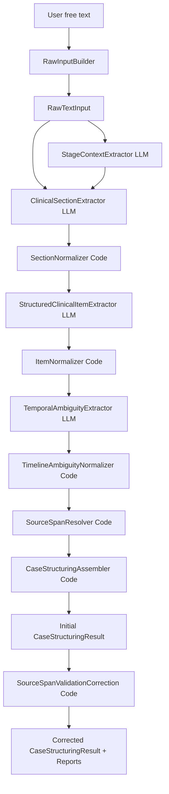

# Case Structurer 教学指南

本文解释当前代码库中的 Case Structurer agent 是怎样工作的。

目标读者是正在搭建 ILD MDT 多智能体研究平台的生物医学工程博士生。本文默认你理解研究目标：希望把患者临床资料逐步变成可追踪、可复用、可被后续 agent 消费的结构化信息。本文重点解释代码架构，而不是解释 ILD 医学诊断。

最重要的边界先放在最前面：

- Case Structurer 不是诊断 agent。
- Case Structurer 不输出最终诊断、鉴别诊断、治疗建议。
- Case Structurer 不输出 `EvidenceAtom`、`HypothesisState`、`Conflict`、`ActionPlan`、`UpdateTrace`、`ArbitrationResult` 或 `SafetyGateResult`。
- Case Structurer 的工作是：把一次用户输入的自由文本，转换成一个 `CaseStructuringResult` 候选结果。
- LLM 负责语义抽取；代码负责确定性包装、ID 规范化、source span 定位、结果组装和一致性校验。

## 1. Case Structurer 解决什么问题

在当前系统里，用户输入始终是自由文本。例如：

```text
患者女，77岁，咳嗽咳痰8年，加重2月。
```

自由文本适合医生或研究者书写，但不适合直接交给后续 agent。原因很具体：

- 后续模块需要知道“哪些是症状，哪些是既往史，哪些是实验室结果”。
- 后续模块需要稳定 ID，例如 `section_001`、`item_003`，否则不同模块之间无法引用同一个对象。
- 后续模块需要 provenance，也就是每个结构化对象来自原文的哪一段。
- 如果直接让后续 agent 在自由文本上推理，就容易出现不可控的自由文本推断。

Case Structurer 做的事情是：针对当前这一次 `raw_text`，生成一个结构化、可溯源的 `CaseStructuringResult`。

它只结构化当前输入。它不会合并完整病史，也不会把多次输入自动整合成一个全局病例状态。比如第一次输入是主诉，第二次输入是补充的 ANA 结果，Case Structurer 会分别为两次输入各产生一个 `CaseStructuringResult`。是否把它们存入同一个 case、如何合并历史、如何更新状态，是应用层或未来状态写入模块的责任。

这对 ILD MDT 多智能体系统很重要：

- 未来的 Evidence Atomizer 可以从 `structured_items` 和 `timeline_events` 中生成证据原子。
- 未来的假设、更新、冲突模块可以依赖稳定 ID 和来源文本。
- 系统可以避免“后续 agent 直接读一大段自由文本然后自由发挥”的不可控路径。

## 2. 高层数据流

当前 pipeline 的精确顺序在 `src/agents/case_structurer/pipeline.py` 中定义：

```text
raw_text
→ RawInputBuilder
→ raw_text wrapped as RawTextInput
→ StageContextExtractor
→ ClinicalSectionExtractor
→ SectionNormalizer
→ StructuredClinicalItemExtractor
→ ItemNormalizer
→ TemporalAmbiguityExtractor
→ TimelineAmbiguityNormalizer
→ SourceSpanResolver
→ CaseStructuringAssembler
→ initial CaseStructuringResult
→ SourceSpanValidationCorrection
→ corrected CaseStructuringResult + validation/correction reports
```

每个箭头表示“前一步的输出成为下一步的输入或上下文”：

- `raw_text → RawInputBuilder`：调用方传入自由文本，代码开始构造系统输入对象。
- `RawInputBuilder → RawTextInput`：代码生成或使用 `case_id`，生成 `input_id`，保存原始文本、输入顺序和父输入关系。
- `RawTextInput → StageContextExtractor`：LLM 辅助判断这次输入在病例流程里的角色，例如是否为初始输入、补充输入、随访输入。
- `StageContextExtractor → ClinicalSectionExtractor`：LLM 在已有 workflow context 下，把原文拆成粗粒度临床段落。
- `ClinicalSectionExtractor → SectionNormalizer`：代码把 section ID、顺序、span 的 `input_id` 规范化。
- `SectionNormalizer → StructuredClinicalItemExtractor`：LLM 在规范化 section 内抽取细粒度临床条目，例如症状、既往史、实验室结果。
- `StructuredClinicalItemExtractor → ItemNormalizer`：代码检查 item 的 `section_id` 是否有效，并规范化 item ID 和顺序。
- `ItemNormalizer → TemporalAmbiguityExtractor`：LLM 基于已有 sections 和 items 抽取时间线事件与源文本歧义。
- `TemporalAmbiguityExtractor → TimelineAmbiguityNormalizer`：代码规范化 event ID、ambiguity ID，并检查引用的 section/item 是否存在。
- `TimelineAmbiguityNormalizer → SourceSpanResolver`：代码用 `quoted_text` 在 `raw_text` 中查找字符位置，填充 `char_start` 和 `char_end`。
- `SourceSpanResolver → CaseStructuringAssembler`：代码把所有对象装配成最终 schema。
- `CaseStructuringAssembler → initial CaseStructuringResult`：初始结构化结果由代码创建，而不是由 LLM 直接生成。
- `SourceSpanValidationCorrection`：代码先验证 source span，再做确定性校正，再次验证；`run()` 返回校正后的 `CaseStructuringResult`，`run_with_validation()` 返回校正结果和报告 bundle。

其中，调用 LLM 的步骤是：

- `StageContextExtractor`
- `ClinicalSectionExtractor`
- `StructuredClinicalItemExtractor`
- `TemporalAmbiguityExtractor`

纯代码步骤是：

- `RawInputBuilder`
- `SectionNormalizer`
- `ItemNormalizer`
- `TimelineAmbiguityNormalizer`
- `SourceSpanResolver`
- `CaseStructuringAssembler`

## 3. `CaseStructurerAgent` 的公开用法

正式使用入口在 `src/agents/case_structurer/__init__.py` 中导出：

```python
from src.agents.case_structurer import CaseStructurerAgent

agent = CaseStructurerAgent()
result = agent.run(
    raw_text="患者女，77岁，咳嗽咳痰8年，加重2月。",
    case_id=None,
    input_order=1,
    parent_input_id=None,
)
```

参数含义：

- `raw_text`：用户输入的原始自由文本。
- `case_id`：病例 ID。新病例可以传 `None`，代码会生成新的 `case_id`。
- `input_order`：同一个病例内第几次输入。当前 agent 不自己维护计数，应该由应用层递增。
- `parent_input_id`：可选字段，用来说明当前输入补充或关联哪一次之前的输入。

这个 agent 不持久化状态。`CaseStructurerAgent.run()` 返回的是一个经过 source-span 验证和确定性校正后的 `CaseStructuringResult` 对象，调用方或未来状态写入模块需要自己保存它。

如果调用方需要检查校正过程，可以使用 `run_with_validation()`：

```python
bundle = agent.run_with_validation(raw_text="患者女，77岁，咳嗽咳痰8年。")

corrected_result = bundle.corrected_result
initial_report = bundle.initial_validation_report
correction_report = bundle.correction_report
final_report = bundle.final_validation_report
residual_issues = bundle.residual_issues
```

`residual_issues` 只作为报告输出，不会让 Case Structurer 主流程中断。

当前实现也不会去历史状态中查找上一条 `StageContext`。`StageContextExtractor` 会把 `previous_stage_id` 设为 `None`。如果应用层需要表达“这次输入补充了哪次输入”，当前可用的是 `RawTextInput.parent_input_id`，也就是调用 `run()` 时传入的 `parent_input_id`。

多轮输入示例：

```python
from src.agents.case_structurer import CaseStructurerAgent

agent = CaseStructurerAgent()

first = agent.run(
    raw_text="患者女，77岁，间断咳嗽咳痰8年，加重2月。",
    case_id=None,
    input_order=1,
    parent_input_id=None,
)

same_case_id = first.input.case_id
previous_input_id = first.input.input_id

second = agent.run(
    raw_text="补充：既往高血压、糖尿病。ANA阳性。",
    case_id=same_case_id,
    input_order=2,
    parent_input_id=previous_input_id,
)
```

这个例子中：

- 第一次输入创建一个新 `case_id`。
- 第二次输入复用第一次返回的 `case_id`。
- `input_order=2` 由应用层传入。
- `parent_input_id` 可以记录“第二次输入补充第一次输入”。
- Case Structurer 会产生两个 `CaseStructuringResult`，每次输入一个。

## 4. Schema 层

schema 位于 `src/schemas/case_structurer/`。它们定义了 Case Structurer 能输出什么，也定义了它不能输出什么。

| Schema | 表示什么 | 逻辑类型 | 谁创建 | 如何进入最终结果 |
|---|---|---|---|---|
| `RawTextInput` | 一次用户自由文本输入的系统包装，包括 `input_id`、`case_id`、`raw_text`、`received_at`、`input_order`、`parent_input_id` | 主要是系统逻辑 | 代码创建，具体由 `RawInputBuilder` 创建 | 作为 `CaseStructuringResult.input` |
| `StageContext` | 当前输入在病例流程中的位置，例如初始输入、补充输入、随访输入，以及与上一阶段关系 | 系统逻辑为主，带少量 workflow 语义 | LLM 辅助分类，但 `case_id`、`input_id`、`stage_order`、`is_initial_stage` 等身份字段由代码控制 | 作为 `CaseStructuringResult.stage_context` |
| `SourceSpan` | 某个结构化对象来自原文的哪段文字，包括 `quoted_text` 和可选字符位置 | 系统 provenance 逻辑 | LLM 先提供或引用 `quoted_text`；代码在 `SourceSpanResolver` 中解析字符 offset | 嵌入 sections、items、events、ambiguities |
| `ClinicalSection` | 原文中的粗粒度临床段落，例如主诉、现病史、既往史、实验室检查、影像 | 临床结构化逻辑和系统 provenance 逻辑都有 | LLM 辅助抽取，代码通过 `SectionNormalizer` 规范化 | 进入 `CaseStructuringResult.clinical_sections` |
| `StructuredClinicalItem` | section 内的细粒度临床事实或源文本陈述，例如咳嗽、咳痰、ANA 阳性、高血压 | 临床结构化逻辑和系统引用逻辑都有 | LLM 辅助抽取，代码通过 `ItemNormalizer` 规范化 | 进入 `CaseStructuringResult.structured_items` |
| `TimelineEvent` | 与时间有关的临床事件，例如症状起病、症状加重、检查完成、治疗开始 | 临床时间结构化逻辑和系统引用逻辑都有 | LLM 辅助抽取，代码通过 `TimelineAmbiguityNormalizer` 规范化 | 进入 `CaseStructuringResult.timeline_events` |
| `AmbiguityItem` | 源文本中不应被强行解释成单一结构化事实的歧义、不足、冲突或不确定陈述 | 临床文本边界逻辑和系统安全边界都有 | LLM 辅助抽取，代码通过 `TimelineAmbiguityNormalizer` 规范化 | 进入 `CaseStructuringResult.ambiguities` |
| `CaseStructuringResult` | 当前一次输入的最终结构化包 | 系统组装和一致性校验逻辑 | 代码创建，具体由 `CaseStructuringAssembler` 创建 | Case Structurer 的唯一正式输出 |

几个关键点：

- `RawTextInput` 不判断文本是主诉、检查还是随访，只保存输入本身。
- `StageContext` 不提取症状、检查、诊断或治疗，只判断 workflow 阶段。
- `ClinicalSection` 是粗粒度段落，不是证据原子。
- `StructuredClinicalItem` 是源文本支持的临床条目，不是诊断结论。
- `TimelineEvent` 描述时间线，不解释诊断意义。
- `AmbiguityItem` 保存不确定性，避免模型把含糊文本硬解释成确定事实。
- `CaseStructuringResult` 会检查跨对象一致性，例如 item 是否引用存在的 section，timeline event 是否引用存在的 item。

## 5. Module 层

模块位于 `src/agents/case_structurer/modules/`。

| 模块 | 输入 | 输出 | 是否调用 LLM | 使用的 schema | 不能做什么 |
|---|---|---|---|---|---|
| `raw_input_builder.py` | `raw_text`、可选 `case_id`、`input_order`、`parent_input_id` | `RawTextInput` | 否 | `RawTextInput` | 不能分类临床内容，不能诊断，不能抽取 item |
| `base_llm_extractor.py` | prompt path、user payload、instruction、template vars | LLM 返回的 JSON 字符串，或解析后的 JSON helper 结果 | 是，作为共享基础设施 | 主要服务所有 LLM extractor | 不知道临床语义，不决定抽取策略，不组装最终结果 |
| `stage_context_extractor.py` | `RawTextInput` | `StageContext` | 是 | `StageContext`、`StageType`、`StageRelation` | 不能抽取临床事实，不能生成诊断、证据或治疗建议 |
| `clinical_section_extractor.py` | `RawTextInput`、`StageContext` | `list[ClinicalSection]` | 是 | `ClinicalSection`、`SourceSpan` | 不能抽取细粒度 item，不能诊断 |
| `structured_item_extractor.py` | `RawTextInput`、`StageContext`、规范化后的 sections | `list[StructuredClinicalItem]` | 是 | `StructuredClinicalItem`、`ClinicalItemType`、`SourceSpan` | 不能发明 section ID，不能把疾病假设当 item type，不能生成 EvidenceAtom |
| `temporal_ambiguity_extractor.py` | `RawTextInput`、`StageContext`、sections、items | `TemporalAmbiguityExtractionResult`，内部包含 `timeline_events` 和 `ambiguities` | 是 | `TimelineEvent`、`AmbiguityItem` | 不能解释时间线的诊断意义，不能强行解决歧义 |
| `normalizers.py` | LLM 产出的 sections、items、events、ambiguities 和合法 ID 集合 | 规范化后的对象和 ID 映射 | 否 | `ClinicalSection`、`StructuredClinicalItem`、`TimelineEvent`、`AmbiguityItem` | 不能做语义抽取，不能改写医学含义 |
| `source_span_resolver.py` | `RawTextInput` 和所有带 `source_spans` 的对象 | 带字符 offset 的对象集合 | 否 | `SourceSpan` 及其宿主对象 | 不能解释临床含义，只能用 `quoted_text` 在 `raw_text` 中查找位置 |
| `assembler.py` | raw input、stage context、sections、items、timeline events、ambiguities | `CaseStructuringResult` | 否 | `CaseStructuringResult`、`StructuringWarning` | 不能再次调用 LLM，不能诊断，不能生成后续 agent 对象 |
| `validators/case_structurer/source_span_validator.py` | 初始或校正后的 `CaseStructuringResult` | `SourceSpanValidationReport` | 否 | `SourceSpanValidationReport` | 不能修改结果，只报告 source-span 问题 |
| `validators/case_structurer/source_span_corrector.py` | 初始 `CaseStructuringResult` 和验证报告 | 校正后的 `CaseStructuringResult`、校正报告、残留问题 | 否 | `SourceSpanValidationCorrectionResult` | 不能改医学语义，只能做确定性 provenance 校正 |

`BaseLLMExtractor` 是共享 LLM 基础设施。它做的事情很具体：

1. 通过 `load_agent_config("case_structurer")` 读取配置。
2. 用 `PromptTemplateRenderer` 渲染 Jinja2 prompt template。
3. 把渲染后的 prompt 作为 system message。
4. 把 `user_payload` 序列化成 JSON，连同 instruction 作为 user message。
5. 调用 `ChatAnywhereClient.generate_json()`。
6. 提供 `parse_json_content()`、`extract_array_payload()`、`coerce_enum_value()`、`prepare_source_spans()` 等通用 helper。

它本身不理解“ANA 阳性是什么意思”，也不决定“咳嗽应该抽成 symptom”。这些语义任务由具体 extractor 的 prompt 和 schema contract 约束完成。

## 6. Prompt template 层

这里有两个目录，职责不同：

```text
src/agents/case_structurer/prompts/
```

这个目录放给 LLM 看的 Jinja2 prompt template，文件后缀是 `.md`。

```text
src/agents/case_structurer/prompting/
```

这个目录放 Python 代码，用来准备变量、渲染 prompt、提供 schema contract 和输出骨架。

关键文件：

- `prompting/template_renderer.py`：封装 Jinja2 渲染。它使用 `StrictUndefined`，所以模板里如果引用了缺失变量，会直接报错，而不是静默渲染成空字符串。
- `prompting/schema_contracts.py`：从 schema enum 中读取允许值，例如 `StageType`、`ClinicalSectionType`、`ClinicalItemType`、`TimelineEventType`。这样 prompt 中的 allowed values 和 schema 保持同步。
- `prompting/prompt_context.py`：把运行时上下文格式化成 prompt 可读文本，包括 raw input 摘要、stage 摘要、可用 sections、可用 items、禁用对象列表、source span policy。
- `prompting/output_skeletons.py`：提供明确的 JSON 输出骨架，让 LLM 知道顶层 key 和字段形状。

一个 prompt 是这样产生的：

1. 某个 extractor 构造 `template_vars`。
2. `template_vars` 同时包含 schema 派生的 allowed values 和当前运行时上下文。
3. `PromptTemplateRenderer.render_file()` 渲染对应 `.md` 模板。
4. `BaseLLMExtractor.generate_json()` 把渲染后的 prompt 作为 system message。
5. `user_payload` 被序列化成 JSON，附在 user message 中发送给 ChatAnywhere。

例如 `StructuredClinicalItemExtractor` 会把以下信息放进 prompt：

- 当前 `input_id`、`case_id`、`raw_text`
- `raw_input_summary`
- `stage_context_summary`
- `available_sections`
- `allowed_item_type_values`
- `allowed_temporality_values`
- `source_span_policy`
- `forbidden_objects`
- `output_skeleton`

## 7. Prompt 文件

四个 prompt 文件位于 `src/agents/case_structurer/prompts/`。

### `prompts/stage_context.md`

LLM 被要求输出一个 StageContext-like JSON object。

它接收的主要变量：

- `input_id`
- `case_id`
- `input_order`
- `raw_input_summary`
- `raw_text`
- `allowed_stage_type_values`
- `allowed_relation_values`
- `allowed_confidence_values`
- `forbidden_objects`
- `output_skeleton`

它禁止：

- 抽取临床事实
- 输出症状、实验室、影像、治疗、诊断
- 输出证据、冲突、行动、仲裁或安全门结果

要求的输出形状是一个 JSON object，例如：

```json
{
  "case_id": "...",
  "input_id": "...",
  "stage_order": 1,
  "stage_type": "...",
  "relation_to_previous_stage": "...",
  "previous_stage_id": null,
  "is_initial_stage": true,
  "classification_confidence": "medium",
  "classification_basis": "..."
}
```

注意：代码会强制控制 `case_id`、`input_id`、`stage_order`、`previous_stage_id` 和 `is_initial_stage`。

### `prompts/clinical_section.md`

LLM 被要求把 `raw_text` 拆成粗粒度临床段落。

它接收的主要变量：

- `input_id`
- `case_id`
- `raw_input_summary`
- `stage_context_summary`
- `raw_text`
- `allowed_section_type_values`
- `allowed_confidence_values`
- `source_span_policy`
- `forbidden_objects`
- `output_skeleton`

它禁止：

- 抽取细粒度临床事实
- 做诊断
- 推荐治疗
- 输出下游对象

要求的顶层输出形状是：

```json
{"clinical_sections": [...]}
```

如果没有可安全抽取的临床段落，应返回：

```json
{"clinical_sections": []}
```

### `prompts/structured_item.md`

LLM 被要求在已有 `ClinicalSection` 里抽取细粒度临床条目。

它接收的主要变量：

- `input_id`
- `case_id`
- `raw_input_summary`
- `stage_context_summary`
- `raw_text`
- `available_sections`
- `allowed_item_type_values`
- `allowed_temporality_values`
- `allowed_certainty_values`
- `allowed_negation_values`
- `allowed_confidence_values`
- `source_span_policy`
- `forbidden_objects`
- `output_skeleton`

它禁止：

- 发明不存在的 `section_id`
- 推断原文没有支持的事实
- 把 `IPF`、`CTD-ILD` 等疾病假设当作 `item_type`
- 输出诊断、鉴别诊断、EvidenceAtom 或治疗建议

要求的顶层输出形状是：

```json
{"structured_items": [...]}
```

如果没有可安全抽取的 item，应返回：

```json
{"structured_items": []}
```

### `prompts/temporal_ambiguity.md`

LLM 被要求抽取时间线事件和源文本歧义。

它接收的主要变量：

- `input_id`
- `case_id`
- `raw_input_summary`
- `stage_context_summary`
- `raw_text`
- `available_sections`
- `available_items`
- `allowed_event_type_values`
- `allowed_time_expression_type_values`
- `allowed_ambiguity_type_values`
- `allowed_confidence_values`
- `source_span_policy`
- `forbidden_objects`
- `output_skeleton`

它禁止：

- 解释时间线的诊断意义
- 推荐治疗
- 发明不存在的 `item_id` 或 `section_id`
- 把不确定诊断写成 Case Structurer 自己的确定诊断

要求的顶层输出形状是：

```json
{"timeline_events": [...], "ambiguities": [...]}
```

如果没有时间线或歧义，应返回：

```json
{"timeline_events": [], "ambiguities": []}
```

## 8. 配置层

配置文件是 `configs/agents.yaml`。当前 `case_structurer` 配置包含：

- `provider: chatanywhere`
- `model: gpt-4.1-mini`
- `temperature: 0.0`
- `max_tokens: 12000`
- `response_format: json_object`
- 四个 prompt path：
  - `stage_context`
  - `clinical_section`
  - `structured_item`
  - `temporal_ambiguity`

`src/config/agent_config.py` 中的 `load_agent_config()` 读取这个配置，并返回 `AgentLLMConfig`。

当前所有 Case Structurer 的 LLM extractor 都通过 `BaseLLMExtractor` 读取同一个 agent config，因此共享同一个模型、温度和 token 上限。不同模块的区别主要在 prompt template：`StageContextExtractor` 用 `stage_context.md`，`ClinicalSectionExtractor` 用 `clinical_section.md`，依此类推。

关于 `response_format`，配置中声明为 `json_object`；当前 `BaseLLMExtractor.generate_json()` 的默认参数也是 `json_object`，各 extractor 没有单独覆盖。因此实际请求会按 JSON object 的形式要求模型返回。

ChatAnywhere 的 API key 和 base URL 不应写进教学文档或源码。当前环境配置入口在：

- `src/config/settings.py`
- `src/llm/chatanywhere_client.py`

运行时应通过环境变量或 `.env` 提供：

```text
CHATANYWHERE_API_KEY
CHATANYWHERE_BASE_URL
```

不要在文档、commit 或示例中包含真实 API key。

## 9. 形式化运行序列示例

输入：

```text
患者女，77岁，间断咳嗽咳痰伴胸闷气短8年，加重2月。既往高血压、糖尿病。ANA阳性。
```

下面是每一步大致会产生什么。这里使用简化伪输出，不是完整 JSON，也不是固定结果。

### 9.1 `RawTextInput`

`RawInputBuilder` 用代码包装原文：

```text
RawTextInput
  input_id: input_...
  case_id: case_...
  raw_text: 患者女，77岁，间断咳嗽咳痰伴胸闷气短8年，加重2月。既往高血压、糖尿病。ANA阳性。
  input_order: 1
  parent_input_id: None
```

这里没有任何诊断推理。只是记录输入。

### 9.2 `StageContext`

`StageContextExtractor` 调用 LLM 判断 workflow 阶段。因为 `input_order=1`，代码会把它作为初始阶段处理：

```text
StageContext
  stage_order: 1
  stage_type: initial_input 或 unknown
  relation_to_previous_stage: new_case_start
  is_initial_stage: true
  classification_basis: 这是一段病例初始临床信息
```

注意：这里的 `classification_basis` 只能解释 workflow 分类，不能写“考虑 CTD-ILD”这类诊断判断。

### 9.3 `ClinicalSection[]`

`ClinicalSectionExtractor` 把原文拆成粗粒度段落，例如：

```text
ClinicalSection[]
  section_001
    section_type: demographics
    normalized_text: 患者女，77岁
    source_spans: "患者女，77岁"

  section_002
    section_type: history_of_present_illness
    normalized_text: 间断咳嗽咳痰伴胸闷气短8年，加重2月
    source_spans: "间断咳嗽咳痰伴胸闷气短8年，加重2月"

  section_003
    section_type: past_medical_history
    normalized_text: 既往高血压、糖尿病
    source_spans: "既往高血压、糖尿病"

  section_004
    section_type: laboratory_test
    normalized_text: ANA阳性
    source_spans: "ANA阳性"
```

随后 `SectionNormalizer` 会按文本顺序规范化 section ID 和 `section_order`。

### 9.4 `StructuredClinicalItem[]`

`StructuredClinicalItemExtractor` 在 sections 内抽取细粒度事实，例如：

```text
StructuredClinicalItem[]
  item_001
    section_id: section_001
    item_type: demographic
    label: sex
    value: female
    source_spans: "女"

  item_002
    section_id: section_001
    item_type: demographic
    label: age
    value: 77
    unit: years
    source_spans: "77岁"

  item_003
    section_id: section_002
    item_type: symptom
    label: cough
    temporality: chronic
    time_text: 8年
    source_spans: ["咳嗽", "8年"]

  item_004
    section_id: section_002
    item_type: symptom
    label: sputum
    temporality: chronic
    time_text: 8年
    source_spans: ["咳痰", "8年"]

  item_005
    section_id: section_002
    item_type: symptom
    label: chest tightness
    temporality: chronic
    time_text: 8年
    source_spans: ["胸闷", "8年"]

  item_006
    section_id: section_002
    item_type: symptom
    label: dyspnea
    temporality: chronic
    time_text: 8年
    source_spans: ["气短", "8年"]

  item_007
    section_id: section_002
    item_type: symptom
    label: symptom worsening
    temporality: recent_worsening
    time_text: 2月
    source_spans: "加重2月"

  item_008
    section_id: section_003
    item_type: comorbidity
    label: hypertension
    source_spans: "高血压"

  item_009
    section_id: section_003
    item_type: comorbidity
    label: diabetes mellitus
    source_spans: "糖尿病"

  item_010
    section_id: section_004
    item_type: lab_result
    label: ANA
    value: positive
    source_spans: "ANA阳性"
```

这些仍然只是结构化条目。`ANA阳性` 不会在这里被解释成某个具体 ILD 诊断。

随后 `ItemNormalizer` 会检查每个 item 的 `section_id` 是否真实存在，并规范化 item ID。

### 9.5 `TimelineEvent[]`

`TemporalAmbiguityExtractor` 可以抽取时间事件，例如：

```text
TimelineEvent[]
  event_001
    event_type: symptom_onset
    event_time_text: 8年
    time_expression_type: duration
    description: 咳嗽咳痰伴胸闷气短持续8年
    related_item_ids: [item_003, item_004, item_005, item_006]
    source_spans: "间断咳嗽咳痰伴胸闷气短8年"

  event_002
    event_type: symptom_worsening
    event_time_text: 2月
    time_expression_type: duration
    description: 症状加重2月
    related_item_ids: [item_007]
    source_spans: "加重2月"
```

这里描述的是时间线，不是“病情进展类型”或“诊断意义”。

### 9.6 `AmbiguityItem[]`

如果这段输入没有明显歧义，可能返回空数组：

```text
AmbiguityItem[]
  []
```

如果原文写“外院考虑间质性肺病，具体诊断不详”，则应该产生 `AmbiguityItem`，而不是把它当作 Case Structurer 的确定诊断。

### 9.7 SourceSpan resolution

LLM 提供的是 `quoted_text`，例如：

```text
quoted_text: "ANA阳性"
char_start: null
char_end: null
```

`SourceSpanResolver` 会在完整 `raw_text` 中查找这段文本，并优先使用 section、item、related item 等局部上下文来消解重复短语。如果找到了，就填充字符位置：

```text
quoted_text: "ANA阳性"
char_start: 某个整数
char_end: 某个整数
```

如果找不到完全匹配，就保留：

```text
char_start: None
char_end: None
```

这一步是纯代码，不解释医学意义。

在组装出初始 `CaseStructuringResult` 后，`SourceSpanValidationCorrection` 会做第二层闭环：

1. `StrictSourceSpanValidator` 检查 quote 是否存在、offset 是否匹配、item 字段是否被自己的 source span 支撑。
2. `DeterministicSourceSpanCorrector` 只修可确定性问题，例如重算 offset、把 quote 改回可唯一定位的原文片段、为缺失字段补最小 source span。
3. validator 再跑一次，剩余问题进入 `residual_issues` 报告，但不直接中断主流程。

### 9.8 `CaseStructuringResult`

`CaseStructuringAssembler` 最后把所有对象组装起来：

```text
CaseStructuringResult
  input: RawTextInput
  stage_context: StageContext
  clinical_sections: [...]
  structured_items: [...]
  timeline_events: [...]
  ambiguities: [...]
  structuring_warnings: [...]
  ready_for_evidence_atomization: true 或 false
```

`CaseStructuringResult` 还会通过 Pydantic validator 检查一致性：

- `stage_context.input_id` 是否等于 `input.input_id`
- 所有子对象是否属于同一个 `RawTextInput`
- item 引用的 section 是否存在
- event 引用的 item 是否存在
- ambiguity 引用的 section/item 是否存在
- 同类对象 ID 是否重复
- 同类对象 order 是否重复

## 10. 这个 agent 有意不做什么

Case Structurer 当前不做以下事情：

- 不做诊断。
- 不做鉴别诊断。
- 不推荐治疗。
- 不创建 `EvidenceAtom`。
- 不维护 hypothesis board。
- 不检测 hypothesis-level conflict。
- 不做 belief revision。
- 不持久化病例状态。
- 不输出最终 MDT 结论。

这些属于后续 agent 或后续 phase。Case Structurer 的价值在于把源文本变成可追踪、可校验、可被后续模块消费的结构化输入。

## 11. 如何连接未来阶段

当前 Case Structurer 输出的 `CaseStructuringResult` 可以成为后续阶段的输入：

- 未来 Evidence Atomizer 可以读取 `structured_items`、`timeline_events` 和 `source_spans`，生成 `EvidenceAtom`。
- 未来 State Writer 可以把每次 `CaseStructuringResult` 存入同一个 case 的状态数据库。
- 未来 Hypothesis 模块可以基于 EvidenceAtoms 维护疾病假设，而不是直接基于自由文本。
- 未来 Update Manager 可以比较新输入和既有状态，产生更新轨迹。
- 未来 Conflict、Safety、Arbiter 模块可以在更高层处理冲突、安全边界和 MDT 汇总。

这些组件在本文中是未来组件，不是当前 Case Structurer 的当前行为。

## 12. Mermaid 图



这张图强调两点：

- LLM 负责从文本中抽取语义候选对象。
- 最终 `CaseStructuringResult` 由代码组装、验证和确定性校正。

## 13. 保持文档准确的边界

本文基于当前代码中的以下文件：

- `src/agents/case_structurer/agent.py`
- `src/agents/case_structurer/pipeline.py`
- `src/agents/case_structurer/modules/*.py`
- `src/agents/case_structurer/prompting/*.py`
- `src/agents/case_structurer/prompts/*.md`
- `configs/agents.yaml`
- `src/schemas/case_structurer/*.py`

当前实现中，Case Structurer 的正式入口是 `CaseStructurerAgent`，正式输出是 `CaseStructuringResult`。

文档中提到的 Evidence Atomizer、State Writer、Hypothesis modules、Update Manager、Conflict、Safety、Arbiter 都应理解为后续阶段或未来组件。它们不是当前 Case Structurer 已经完成的行为。

如果未来代码发生变化，尤其是以下部分变化，本文也需要同步更新：

- pipeline 顺序变化
- schema 字段变化
- prompt 文件变化
- LLM 配置变化
- 新增状态持久化、EvidenceAtom 生成或诊断输出
